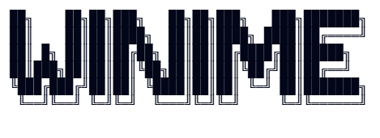

<div align="center">
    <br><br>
    
    <a><h3>智能的 Neovim 自动输入法切换插件</h3></a>

<p>
    <a href="https://github.com/StellarDeca/winime.nvim/releases/latest">
        
    </a>
    <a href="https://github.com/StellarDeca/winime.nvim/pulse">
        
    </a>
    <a href="https://github.com/StellarDeca/winime.nvim/blob/main/LICENSE">
        
    </a>
    <a href="https://github.com/StellarDeca/winime.nvim/stargazers">
        
    </a>
    <a href="https://github.com/StellarDeca/winime.nvim/issues">
        
    </a>
    <a href="https://github.com/StellarDeca/winime.nvim">
        
    </a>
    <br/>
    
    
</p></div>

🌍 [English](./README_EN.md) | [简体中文](./README.md)

---

## 👋 欢迎使用 Winime！
**Winime** 是一款专为 Neovim 设计的智能输入法切换插件，能够根据编辑上下文和编辑模式自动切换系统输入法，
让你在编写代码和注释时无需手动切换，大幅提升混合语言编辑效率。<br>
***⚠️ 注意: Winime 目前仅仅支持 Windows 系统，了解更多信息请见 FAQ 部分***

<div align="center">
  
</div>


## ✨ 特性

<table>
<tr>
<td width="50%">

### 🎨 智能检测
- 🔍 **自动探测** - 首次启用时自动检测系统可用输入法
- 🌲 **TreeSitter 支持** - 基于语法树精确识别代码结构
- 📝 **字符串分析** - 内置字符串模式分析引擎
</td>
<td width="50%">

### ⚡ 自动切换
- 🔄 **模式感知** - Insert/Normal 模式智能切换
- 💬 **注释识别** - 自动识别注释区域并切换输入法
- 🎯 **上下文感知** - 根据当前编辑位置智能判断
</td>
</tr>
</table>


## 📦 安装
### 使用 [lazy.nvim](https://github.com/folke/lazy.nvim)
```lua
return {
    "StellarDeca/winime.nvim",
    opts = {
        winime_core = {
            grammer_analysis_mode = "Auto",  -- 可选: "Auto" | "TreeSitter" | "String"
        },
    },
    event = { "VimEnter", "VeryLazy" },
    dependencies = (function()
        -- ⚠️ 注意: mode 应与 opts.winime_core.grammer_analysis_mode 一致
        local mode = "Auto"  
        if mode == "TreeSitter" then
            return { "nvim-treesitter/nvim-treesitter" }
        elseif mode == "Auto" then
            return {
                "nvim-treesitter/nvim-treesitter",
                event = { "BufEnter", "BufNewFile" },
            }
        end
        return {}
    end)(),
}
```
### 使用 [packer.nvim](https://github.com/wbthomason/packer.nvim)
```lua
use {
    'StellarDeca/winime.nvim',
    config = function()
        require('winime').setup({
            winime_core = {
                grammer_analysis_mode = "Auto",
            },
        })
    end
}
```

### 分析模式说明

|        模式         | 说明       | 优点        | 缺点                              |
|:-----------------:|:---------|:----------|:--------------------------------|
|    🤖 **Auto**    | 自动选择最佳模式 | 智能切换，最佳体验 | 需要 TreeSitter                   |
| 🌲 **TreeSitter** | 基于语法树分析  | 精确度高      | 需要 TreeSitter 支持, 对于大型文件存在性能问题  |
|   📝 **String**   | 基于字符串模式  | 无依赖       | 精确度相对较低, 对于中大型文件存在性能问题,精度略微存在不足 |

## 🎮 使用

### 📋 Neovim 命令

| 命令                         | 描述                            |
|:---------------------------|:------------------------------|
| `:WinimeReload`            | 🔄 重新载入插件（将会完全使用默认配置并再次探测输入法） |
| `:WinimeUnload`            | 🔌 卸载 Winime（移除自动命令与绑定）       |
| `:WinimeFileTypeAvaliable` | 📄 列出当前支持的文件类型                |


## ❓ FAQ

<details>
<summary><b>🔴 首次启动自动探测失败？</b></summary>

请确认系统安装了至少两种输入法。若仍失败，请删除缓存目录：
```bash
# Windows
~/AppData/Local/nvim-data/winime
```
然后重启 Neovim。
</details>

<details>
<summary><b>🔎 如何优化 Winime 的启动时长？</b></summary>

若希望避免 Winime 随 Neovim 一同启动，可在 lazy.nvim 配置中为其指定其他启动事件。

⚠️ 注意：
Winime 需要依赖特定事件完成运行时数据初始化，擅自修改启动事件可能导致插件功能异常。
相关问题排查请参考 FAQ 中「🟡 修改启动条件后插件报错？」章节。
</details>

<details>
<summary><b>🟡 修改启动条件后插件报错？</b></summary>

确保 Winime 在相关自动命令触发前已正确加载：
- `BufEnter`
- `BufNewFile`
- `CursorMoved`
- `InsertEnter`
- `TextChangedI`
- `CursorMovedI`
- `InsertLeave`
</details>

<details>
<summary><b>🟢 支持 Mac / Linux 吗？</b></summary>

默认仅支持 Windows（使用 `im-select.exe`）。要支持其他平台：
1. 替换 `lua/winime/tools/im-select.exe` 为对应平台工具
2. 在 `lua/winime/tools/method.lua` 中实现平台调用接口
3. 检查输入法区域ID是否适配
4. 欢迎提交 PR 贡献代码 💪
</details>

<details>
<summary><b>🔒 隐私问题？会收集敏感信息吗？</b></summary>

**绝对不会！** Winime：
- ❌ 不会上传任何数据
- ❌ 不会分享任何日志
- ✅ 仅在本地保存必要的分析历史
- ✅ 所有数据仅存储在本地文件夹
</details>

## 🗺️ Future

### 🚀 即将推出

- [ ] 🔤 **标点统一替换** - 在 Insert 模式下智能替换中英文标点
  - 支持按 filetype 配置
  - 支持自定义替换表
  - 上下文感知替换策略

### 💡 仍在计划中
- [ ] 📊 多系统支持
  - 🐧 Linux 支持
  - 🍎 macOS 支持


## 🤝 贡献
欢迎提交 Issue 和 Pull Request！
<div align="center">

### 💖 贡献者
<a href="https://github.com/StellarDeca/winime.nvim/graphs/contributors">
    
</a>
</div>

## 📄 许可证
- **主程序**: [GNU GPLv3](LICENSE) - 详见仓库根目录
- **im-select.exe**: [MIT License](LICENSES/im-select) - 来自 [im-select](https://github.com/daipeihust/im-select) 项目

---

<div align="center">

**如果这个项目对你有帮助，请给个 ⭐ Star 支持一下！**
<br>
Made with ❤️ by [StellarDeca](https://github.com/StellarDeca)
</div> 


