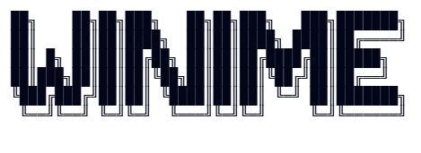

      
    
    <a><h3>Intelligent Neovim plugin for automatic input method switching</h3></a>

    
    
    
    
    
    
     
    
    

🌍 [English](./README_EN.md) | [简体中文](./README.md)

---
